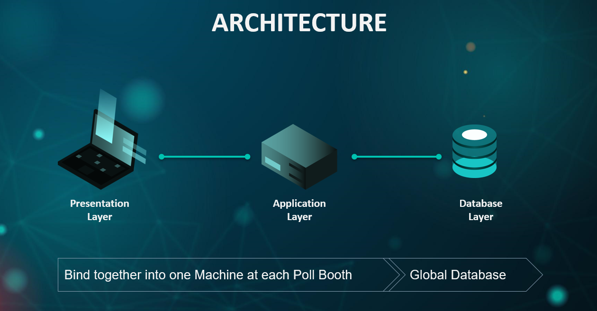

# AI EVM - (Electronic Voting Machine Powered by AI):
<br>


<br>

## Demo

Click to watch full demo (by Satyendra Yadav) <br>

[](https://drive.google.com/file/d/1QwlWrVxVcpSU3ffnwAzOTcl1Q1ggCN-T/view?usp=sharing)

<br>

## Team
- Mohith Kune (me)
- Satyendra Yadav
- Venkatesh Vutukuri
- Ankit Chouhan
- Pooja Yadav

<br>

## Introduction

Most of the sectors have been automated these days but the Voting process has stayed un-updated for years. We propose to leverage AI and use it with EVMs to bring revolution to the voting process.


The AI-powered EVMs can reduce many costs due to manual work at the polling booths. They also help to check malpractices by using Computer Vision.

<br>

## Project Pre-requisite Steps

It is suggested to use virtual `python==3.6` environment for this project.

<br>

If you have anaconda installed, you can create a new empty virtual enviroment as shown below
```bash
conda create --name AI_EVM_env python=3.6

# for activating env
conda activate AI_EVM_env

# for deactivating
conda deactivate
```

<br>

And navigate to the project to install dependecies. 

(Please feel free to raise an issue if run into problems while installing `dlib`)
```bash
pip install -r requirements.txt
```
<br>

Now before running the Django project for the first time, db tables have to be created.
```bash
# makemigrations (It will generate schemas)
python manage.py makemigrations

# migrate (It will create tables in the db)
python manage.py migrate

# create an admin account for the project
python manage.py createsuperuser
```
<br>

Run the Django server on localhost on port 5000
```bash
python manage.py runserver 0.0.0.0:5000
```

## Deployment

The project architecture is divided into three layers as below. 

<br>



<br>

Since the server has to collect, analyze & reply with video stream in realtime, deploying server on internet at different location is not encourage.

The Presentation & Application layer are bind together in one Machine.

The main settings for deployment are:
- SECRET_KEY: It is important to make this variable secret. We propose to add this variable to the server environment & load at runtime as below.
```bash
# Read SECRET_KEY from an environment variable
import os
SECRET_KEY = os.environ['SECRET_KEY']
```

- DEBUG: This variable must be set to `False` before deploying!
- ALLOWED_HOSTS: This variable must contain the possible web domains from which we wish to visit the website.
```bash
ALLOWED_HOSTS = ['localhost', '0.0.0.0', '127.0.0.1', 'ai.evm.org']
```

- MailJet API Keys: These variable must be stored in the environment simialr to the `SECRET_KEY`
```bash
MAILJET_API_KEY = '*****************'
MAILJET_API_SECRET = '*****************'
```

- We propose to deploy using `gunicorn` & `Nginx`. The installation steps for these tools are different/specific to the platform we want to deploy on. Kindly refer the official documentation for installing.

- After installing `gunicorn` we can run the server using the below command
```bash
gunicorn --bind 0.0.0.0:8000 ai_evm.wsgi
```

- We can create a service/process on the server to run the above command & this step is also platform specific. For example we can create `gunicron.service`.

- If using Linux, we then submit this process to `systemctl` to run at every reboot.
```bash
sudo systemctl start gunicorn.service
sudo systemctl enable gunicorn.service
sudo systemctl status gunicorn.service
```

<br>

## NOTE
- Face Recognition phase may not recognize your face
  - Head to `models/src/Face_Recognition` to generate files & place inside `models/recognize_face_models`.
- Create a superuser so that you can view admin section. The db included here has dummy data used for the demo.

<br>

## Future Scope
We have added basic/major functionality. But always can be improved with more features like below.
- Biometric authentication can be added to strengthen auth process
- ATM like voting from remote places. No need to travel
- Online Voting is still a dream. We can try our best always!
- Voting data collected can be linked to aadhar, driving license, PAN etc - Govt db warehouse

